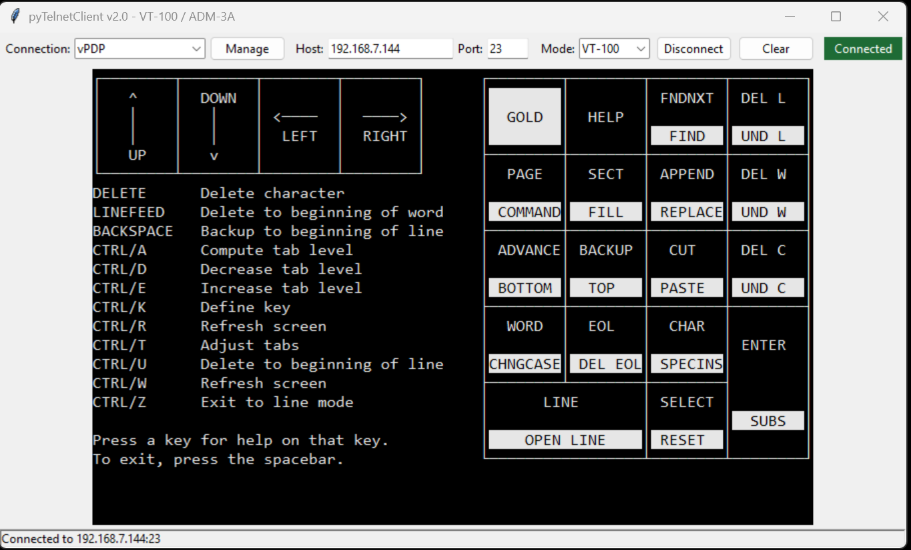

# pyTelnetClient

A telnet client for a CP/M machine, emulating an ADM-3A terminal as was common in CP/M 2.2 days.

The ADM-3A emulation is needed for programs like WordStar and other non-console applications such as SuperCalc. Version 2.1 includes VT-100 keyboard handling, line drawing characters, inverse video, connection profiles, automatic reconnect, an 80×24 display, and up to 1000 lines of selectable scrollback.

Display is **80×24** with up to **1000 lines** of scrollback (mouse wheel or scrollbar). Select and copy work across the live screen and scrollback.



## Running

Run from an Anaconda prompt:

```powershell
python pyTelnetClient.py
```

## Version

Dean Gienger, 13 May 2026

Version 2.1, 5 August 2026

## Saved Connections

Saved connections are stored in:

```text
%APPDATA%\pyTelnetClient\connections.json
```
